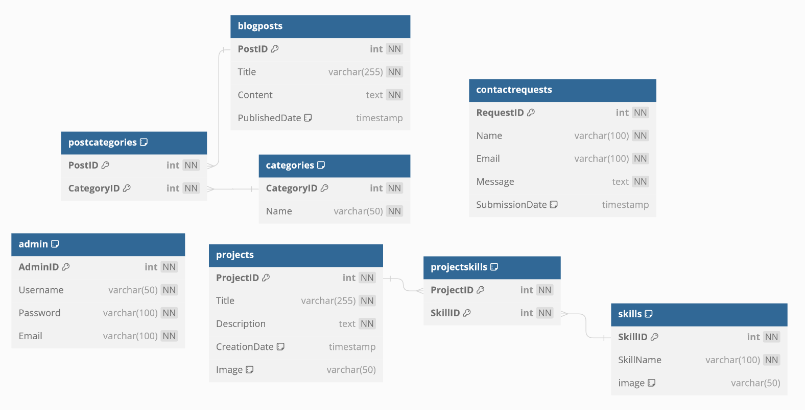
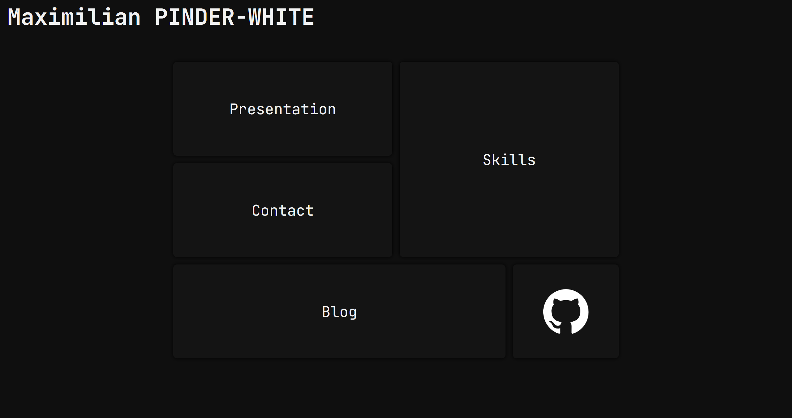
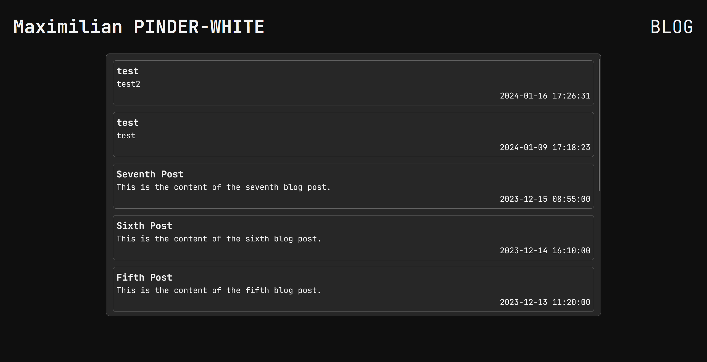
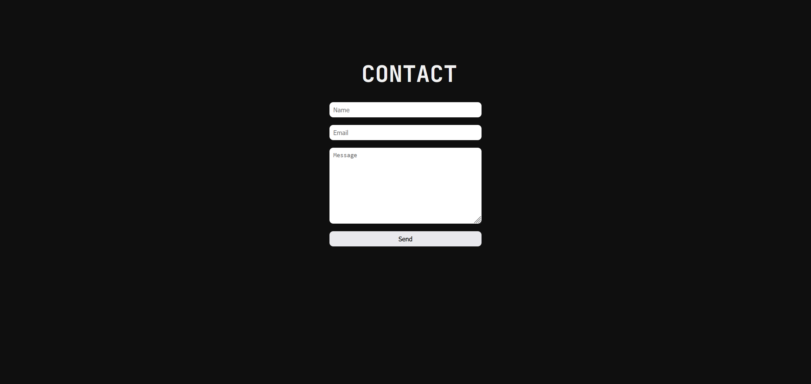
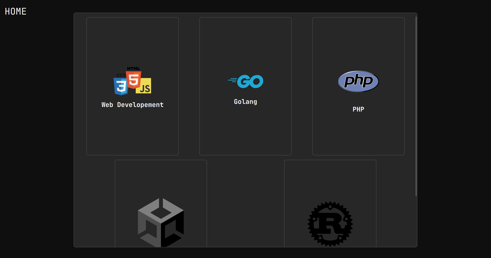
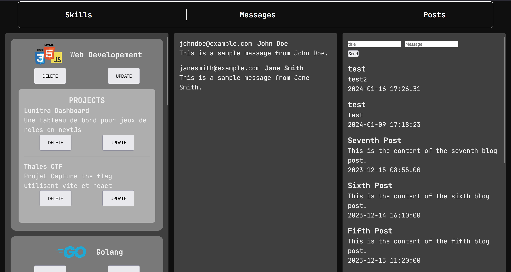

# La Base de Données

La structure et le fonctionnement de la base de données se compose de plusieurs tables interconnectées, chacune ayant un rôle spécifique.

## Tables

### Table `admin`
- **AdminID** (int) : Clé primaire, auto-incrémentée, non nulle.
- **Username** (varchar(50)) : Nom d'utilisateur, unique et non nul.
- **Password** (varchar(100)) : Mot de passe, non nul.
- **Email** (varchar(100)) : Adresse e-mail, unique et non nulle.

### Table `blogposts`
- **PostID** (int) : Clé primaire, auto-incrémentée, non nulle.
- **Title** (varchar(255)) : Titre du post, non nul.
- **Content** (text) : Contenu du post, non nul.
- **PublishedDate** (timestamp) : Date de publication, valeur par défaut `CURRENT_TIMESTAMP`.

### Table `categories`
- **CategoryID** (int) : Clé primaire, auto-incrémentée, non nulle.
- **Name** (varchar(50)) : Nom de la catégorie, unique et non nul.

### Table `contactrequests`
- **RequestID** (int) : Clé primaire, auto-incrémentée, non nulle.
- **Name** (varchar(100)) : Nom de la personne contactant, non nul.
- **Email** (varchar(100)) : Adresse e-mail, non nulle.
- **Message** (text) : Message, non nul.
- **SubmissionDate** (timestamp) : Date de soumission, valeur par défaut `CURRENT_TIMESTAMP`.

### Table `postcategories`
- **PostID** (int) : ID du post, non nul.
- **CategoryID** (int) : ID de la catégorie, non nul.

### Table `projects`
- **ProjectID** (int) : Clé primaire, auto-incrémentée, non nulle.
- **Title** (varchar(255)) : Titre du projet, non nul.
- **Description** (text) : Description du projet, non nulle.
- **CreationDate** (timestamp) : Date de création, valeur par défaut `CURRENT_TIMESTAMP`.
- **readme/image** (varchar(50)) : readme/image, valeur par défaut NULL.

### Table `projectskills`
- **ProjectID** (int) : ID du projet, non nul.
- **SkillID** (int) : ID de la compétence, non nul.

### Table `skills`
- **SkillID** (int) : Clé primaire, auto-incrémentée, non nulle.
- **SkillName** (varchar(100)) : Nom de la compétence, unique et non nul.
- **readme/image** (varchar(50)) : readme/image, valeur par défaut NULL.

## Indexes et Relations

Chaque table possède des index pour optimiser les requêtes et des contraintes pour assurer l'intégrité des données.

### Relations
- **blogposts** et **postcategories** sont liés par `PostID`.
- **categories** et **postcategories** sont liés par `CategoryID`.
- **projects** et **projectskills** sont liés par `ProjectID`.
- **skills** et **projectskills** sont liés par `SkillID`.

Toutes les relations sont configurées pour supprimer en cascade, ce qui signifie que la suppression d'un élément dans une table parent entraînera la suppression des éléments correspondants dans la table enfant.

# La Home Page


## Structure de la Page d'Accueil

La page d'accueil est conçue avec une grille qui positionne chaque élément de manière statique. Cette approche garantit une uniformité de la structure sur divers écrans, à l'exception des écrans mobiles. Pour ces derniers, la disposition change pour adopter un style `display: flex;` avec une `flex-direction: column;`. Cette modification assure une meilleure adaptabilité et lisibilité sur les appareils mobiles.

## Effets Visuels et Interactivité

Pour enrichir l'expérience utilisateur, un effet JavaScript a été intégré. Cet effet ajoute des animations aux boîtes et aux textes de la page. Cette touche interactive vise à rendre la navigation plus dynamique et engageante, améliorant ainsi l'interaction globale avec l'utilisateur.

# Page Blog


## Disposition des Éléments

Le thème central du portfolio est la disposition des éléments au sein d'une div centrale. Cette approche est adoptée ici sur la page du blog. Les éléments enfants sont agencés à l'aide de la propriété `flex: wrap;`. Ce style permet une organisation fluide et adaptable des posts de blog.

## Organisation des Posts

Les posts sur la page blog sont organisés de manière chronologique. Cette disposition est réalisée grâce à la requête SQL suivante : `SELECT * FROM blogposts ORDER BY PublishedDate DESC`. Cette commande sélectionne tous les posts du blog et les trie par date de publication, affichant les plus récents en premier.

## Fonctionnalité du Bouton Blog

Le bouton "Blog" ne sert pas uniquement à naviguer dans cette section ; il fait également office de lien de retour vers la page d'accueil. Cette fonctionnalité offre aux utilisateurs un moyen pratique et rapide de retourner à la page principale à tout moment.


# Page Contact



## Structure de la Page

La page de contact maintient la cohérence avec la structure générale du site. Elle présente un formulaire centralisé qui inclut des champs pour saisir le nom, l'adresse e-mail et le message de l'utilisateur.

## Fonctionnement du Formulaire

### Présentation du Formulaire
Le formulaire est conçu pour recueillir les informations essentielles de l'utilisateur : son nom, son adresse e-mail et un message. Les données sont envoyées en utilisant la méthode POST pour assurer la sécurité des informations transmises.

### Traitement des Données
Lorsque l'utilisateur soumet le formulaire, les données sont traitées par un script PHP. Ce script est responsable de :

1. **Validation des Données :** Vérifier que les données reçues sont valides et complètes.
2. **Interaction avec la Base de Données :** Utiliser une classe `DatabaseHandler` pour insérer les données dans la base de données. Cette classe gère toutes les interactions avec la base de données, assurant ainsi la modularité et la maintenance aisée du code.
3. **Redirection :** Après la soumission du formulaire, l'utilisateur est redirigé vers la page de contact. Cette étape est cruciale pour éviter les soumissions multiples en cas de rafraîchissement de la page.

## Sécurité
Le formulaire utilise la méthode POST pour la soumission des données, ce qui est une pratique standard pour protéger les informations sensibles. De plus, le script PHP devrait inclure des mesures de sécurité appropriées, comme le nettoyage des données pour prévenir les injections SQL.

# La Page Skills


La page « Compétences » est conçue pour présenter les projets associés à chaque compétence ou technologie. Elle offre une vue d'ensemble des différents savoir-faire et de leur application concrète dans divers projets.
Fonctionnement de l'Affichage
Génération Dynamique des Compétences

Pour chaque compétence listée, une requête SQL est effectuée à la base de données. Cette requête a pour but de récupérer les projets associés à une compétence spécifique. La requête utilisée est :

```sql
SELECT p.* FROM projects p INNER JOIN projectskills ps ON p.ProjectID = ps.ProjectID WHERE ps.SkillID = :skillId
```

Elle permet de sélectionner tous les projets liés à une compétence donnée, identifiée par :skillId.

## Structure de la Page

La page est structurée en plusieurs div. Chaque div représente une compétence et contient une sous-div qui elle-même génère dynamiquement la liste des projets associés à cette compétence. Initialement, ces projets ne sont pas directement visibles.

## Interaction Utilisateur

### Sélection et Affichage des Projets

Lorsqu'un utilisateur clique sur une compétence, un code JavaScript entre en action. Ce code ajoute la classe selected à l'élément cliqué. Cette action a plusieurs effets :

- Elle augmente la taille de l'élément pour qu'il prenne toute la largeur et la hauteur de sa div parent.
- Elle positionne cet élément en premier grâce à skill.style.order = '-1';.

### Gestion de l'Espace

Si une compétence est associée à plusieurs projets, pour gérer l'espace efficacement et éviter un débordement, la propriété CSS overflow-y: auto est ajoutée. Cela permet de faire défiler les projets à l'intérieur de la div sans prendre trop de place sur la page.

# Panel Administrateur

## Accès au Panel

Le panel administrateur est accessible via l'URL `/admin`. Le point d'entrée du site est le fichier `index.php` situé dans le répertoire public.
## Structure du Panel

L'interface est structurée en quatre sections principales organisées grâce à une grille CSS :

- En-tête : Située en haut de la page.
- Liste des Compétences : Située à gauche, elle affiche les compétences et les projets associés en colonne. Chaque compétence et projet dispose de boutons **DELETE** et **UPDATE** pour la gestion.
- Messages : Au centre, cette section répertorie les messages de contact reçus via la page `/contact`, affichés du plus récent au plus ancien.
- Posts du Blog : À droite, elle contient tous les posts du blog. Un formulaire est inclus pour permettre la publication de nouveaux articles. Cette fonctionnalité a été déplacée vers le panel administrateur pour des questions de sécurité et de centralisation.

## Gestion des Compétences

Pour chaque compétence et projet, le bouton UPDATE ouvre une boîte de dialogue (`<dialog></dialog>`), servant d'overlay. Cette interface contient des champs modifiables tels que le nom, la description, et l'readme/image. Une fois modifiés, les changements sont automatiquement répercutés dans la base de données.

## Messages et Posts

- La section des messages centralise la communication avec les utilisateurs, permettant un suivi facilité.
- La section des posts offre un espace dédié à la création et la gestion des contenus du blog, précédemment accessible depuis la page publique, mais désormais exclusivement depuis le panel administrateur pour renforcer la sécurité et l'efficacité de la gestion du site.